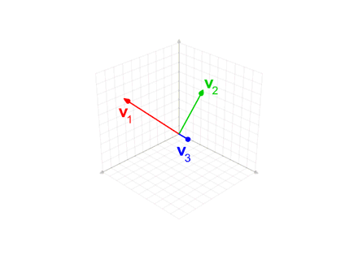

###### Linear Spaces ######
## Gram-Schmidt Orthogonalization ##

<p align="center">
  
</p>

### Algorithm ###
The following MATLAB algorithm implements modified Gram–Schmidt orthonormalization. The vectors v1, ..., vk (columns of matrix V, so that V(:,j) is the jth vector) are replaced by orthonormal vectors (columns of U) which span the same subspace.

``` MATLAB
    function U = gramschmidt(V)
        [n, k] = size(V);
        U = zeros(n,k);
        U(:,1) = V(:,1) / norm(V(:,1));
        for i = 2:k
            U(:,i) = V(:,i);
            for j = 1:i-1
                U(:,i) = U(:,i) - (U(:,j)'*U(:,i)) * U(:,j);
            end
            U(:,i) = U(:,i) / norm(U(:,i));
        end
    end
```
------------------------------------------------------------------------------------------
#EE501 - [[Linear Systems Theory]] at [[METU]]