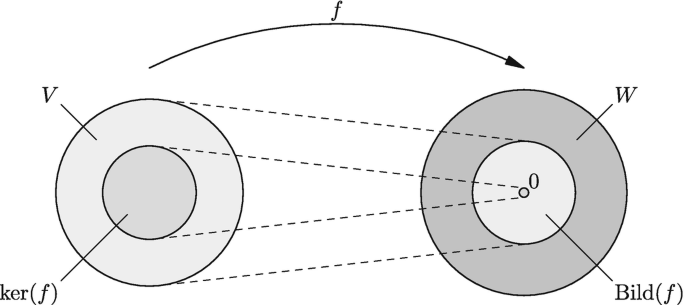
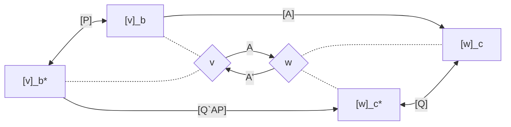

###### Linear Transformations ######
## Linear Mapping ##

**Definition**: Let $V$ and $W$ be linear spaces over the same field $F$. A mapping $\mathcal{T}: V \rightarrow W$ is called a linear mapping satisfying 

$$\mathcal{T}(ax+by) = a\mathcal{T}(x) + b\mathcal{T}(y) \ \ \ \ \ \ \forall x,y \in V \ \ \ \ \ \ \forall a,b \in F$$

here $V$ is called the domain of $T$ and $W$ is called the codomain of $\mathcal{T}$.

------------------------------------------------------------------------------------------
<ins>Example</ins>: Let $V = W$ polynomials of degree less than $n$ in $S$; $\mathcal{T} = \frac{d}{ds}$

**_Solution_**: Let $p,q \in V$ and $\alpha_1,\alpha_2 \in F$ then ,   
p(s) = $\sum_{i=0}^{n-1} a_is^i$ and q(s) = $\sum_{i=0}^{n-1} b_is^i$  
$\alpha_1p(s) + \alpha_2q(s) = \sum_{i=0}^{n-1} (\alpha_1a_i + \alpha_2b_i)s^i$  
$\frac{d}{ds}(\alpha_1p(s) + \alpha_2q(s)) = \sum_{i=0}^{n-1} (\alpha_1a_i + \alpha_2b_i)is^{i-1} = \alpha_1\sum_{i=0}^{n-1} a_is^{i-1} + \alpha_2\sum_{i=0}^{n-1} b_is^{i-1} = \alpha_1\frac{dp}{ds} + \alpha_2\frac{dq}{ds}$  
$\mathcal{T}(\alpha_1p+\alpha_2q) = \frac{d}{ds}(\alpha_1p+\alpha_2q) = \alpha_1\frac{dp}{ds} + \alpha_2\frac{dq}{ds} = \alpha_1\mathcal{T}(p) + \alpha_2\mathcal{T}(q) \ \blacksquare$

------------------------------------------------------------------------------------------
<ins>Example</ins>: Let $V = W = \mathbb{R^2}$. Let $\mathcal{A}$ be defined as,  
$$\mathcal{A} = \begin{bmatrix} \alpha_1 \\ \alpha_1 + \alpha_2 \end{bmatrix} \text{where } x = \begin{bmatrix} \alpha_1 \\ \alpha_2 \end{bmatrix}$$

**_Solution_**: 
Let $a,b \in F$ and $x_1,x_2 \in X$ with $x_1 = \begin{bmatrix} \alpha_1 \\ \alpha_2 \end{bmatrix}$ and $x_2 = \begin{bmatrix} \beta_1 \\ \beta_2 \end{bmatrix}$ then,  
$\mathcal{A}(ax_1 + bx_2) = \mathcal{A}(a\begin{bmatrix} \alpha_1 \\ \alpha_2 \end{bmatrix} + b\begin{bmatrix} \beta_1 \\ \beta_2 \end{bmatrix}) = \mathcal{A}(\begin{bmatrix} a\alpha_1 \\ a\alpha_2 \end{bmatrix} + \begin{bmatrix} b\beta_1 \\ b\beta_2 \end{bmatrix}) = \mathcal{A}(\begin{bmatrix} a\alpha_1 + b\beta_1 \\ a\alpha_2 + b\beta_2 \end{bmatrix}) = \begin{bmatrix} a\alpha_1 + b\beta_1 \\ a\alpha_1 + a\alpha_2 + b\beta_1 + b\beta_2 \end{bmatrix} = a\begin{bmatrix} \alpha_1 \\ \alpha_1 + \alpha_2 \end{bmatrix} + b\begin{bmatrix} \beta_1 \\ \beta_1 + \beta_2 \end{bmatrix} = a\mathcal{A}(x_1) + b\mathcal{A}(x_2) \ \blacksquare$

------------------------------------------------------------------------------------------
<ins>Example</ins>: Let $V = W = \mathbb{R}$.    is $ \  \mathcal{A}x = (1-x)$ linear or not ? 

**_Solution_**: Let $a,b \in F$ and $x_1,x_2 \in X$ then,  

$$\begin{align*}
\mathcal{A}(ax_1 + bx_2) &\stackrel{?}{=} a\mathcal{A}(x_1) + b\mathcal{A}(x_2) \\
1 - (ax_1 + bx_2)  & \stackrel{?}{=} a(1-x_1) + b(1-x_2) \\
1 - ax_1 - bx_2  & \stackrel{?}{=} a - ax_1 + b - bx_2 \\
1 & \neq a + b \ \ \forall a,b \in F  \ \blacksquare\\ 
& \text{ hence not linear } \ 
\end{align*}$$

> Rotation transformations in $\mathbb{R}^2$ are linear transformations.  
> Integration and differentiation are linear transformations.

**Definition**: Given a linear mapping $\mathcal{T}: V \rightarrow W$, the set of all vectors $x \in V$ such that $\mathcal{T}(x) = 0_W$ is called the null space of $\mathcal{T}$ and is denoted by $N(\mathcal{T})$. That is,

$$N(\mathcal{T}) := \{x \in V \ : \ \mathcal{T}(x) = 0_W\}$$

**Definition**: Given a linear mapping $\mathcal{T}: V \rightarrow W$, the set of all vectors $w \in W$ such that $w = \mathcal{T}(v)$ for some $v \in V$ is called the range of $\mathcal{T}$ and is denoted by $R(\mathcal{T})$. That is,

$$R(\mathcal{T}) := \{w \in W \ : \ w = \mathcal{T}(v) \ \text{for some} \ v \in V\}$$

  
  <!-- src="https://upload.wikimedia.org/wikipedia/commons/4/4c/KerIm_2015Joz_L2.png" /> -->

------------------------------------------------------------------------------------------
<ins>Claim</ins>: For a given linear mapping $\mathcal{T}: V \rightarrow W$, $N(\mathcal{T})$ is a linear subspace of $V$.

**_Proof_**: Let $x_1,x_2 \in N(\mathcal{T})$ and $a \in F$ show,

(S1). $x_1 + x_2 \in N(\mathcal{T})$  
(S2). $ax_1 \in N(\mathcal{T})$

1- $\mathcal{T}(x_1 + x_2) = \mathcal{T}(x_1) + \mathcal{T}(x_2) = 0_W + 0_W = 0_W \implies x_1 + x_2 \in N(\mathcal{T})$  
2- $\mathcal{T}(ax_1) = a\mathcal{T}(x_1) = a0_W = 0_W \implies ax_1 \in N(\mathcal{T}) \ \blacksquare$

------------------------------------------------------------------------------------------
<ins>Claim</ins>: For a given linear mapping $\mathcal{T}: V \rightarrow W$, $R(\mathcal{T})$ is a subspace of $W$.

**_Proof_**: Let $x_1,x_2 \in R(\mathcal{T})$ and $a \in F$ show,

(S1). $x_1 + x_2 \in R(\mathcal{T})$  
(S2). $ax_1 \in R(\mathcal{T})$

> **Definition**: A linear transformation $\mathcal{T}: V \rightarrow W$ is called one-to-one if $x_1 \neq x_2$ implies $\mathcal{T}(x_1) \neq \mathcal{T}(x_2)$ for all $x_1,x_2 \in V$.

------------------------------------------------------------------------------------------
<ins>Theorem</ins>: Let $\mathcal{T}: V \rightarrow W$ be a linear transformation. Then mapping $\mathcal{T}$ is one-to-one if and only if $N(\mathcal{T}) = \{0_V\}$.  

**_Proof_**: We will prove the statement by contrapositive. Since it is an if and only if statement, we will prove both directions.  

(Bacward direction) Assume that $N(\mathcal{T}) = \{0_V\}$ and $\mathcal{T}(x_1) = \mathcal{T}(x_2)$ for some $x_1,x_2 \in V$. Then,  
$\mathcal{T}(x_1) - \mathcal{T}(x_2) = 0_W$  
$\mathcal{T}(x_1 - x_2) = 0_W$  
$x_1 - x_2 \in N(\mathcal{T})$  
$x_1 - x_2 = 0_V$  
$x_1 = x_2$  
$\mathcal{T}$ is one-to-one.  

(Forward direction) Assume that $\mathcal{T}$ is one-to-one and $x \in N(\mathcal{T})$. Then,  
$\mathcal{T}(x) = 0_W$  
$\mathcal{T}(0_V) = 0_W$  
$x = 0_V$  
$N(\mathcal{T}) = \{0_V\}$ $\blacksquare$

**_Definition_**: A linear transformation $\mathcal{T}: V \rightarrow W$ is called onto if $R(\mathcal{T}) = W$, otherwise if $R(\mathcal{T}) \subset W$ then $\mathcal{T}$ is called into.

------------------------------------------------------------------------------------------
<ins>Example</ins>:  Let $V := \{f:[0, 1] \rightarrow \mathbb{R} \text{ and  f is integrable} \}$. A transformation $\mathcal{A}: V \rightarrow \mathbb{R}$ is defined as,  
$$\mathcal{A}(f(s)) = \int_{0}^{1} f(s)ds \\
\text{is $\mathcal{A} $ one-to-one ?}$$

**_Solution_**: Integration operation resulting in one-to-one transformation probably not true. Hence we can exploit the fact that the integration might result in zero.

Let $f(s) = 2s-1$ then,  

$\mathcal{A}(f(s)) = \int_{0}^{1} (2s-1)ds = \left[s^2-s\right]_{0}^{1} = 0$  
$\mathcal{A}(f(s)) = 0$  
Then $\mathcal{A}(0) = 0_w$ and $\mathcal{A}(f(s)) = 0_w$ for some $f(s) \neq 0$.  
$\mathcal{A}$ is not one-to-one.

moreover, 

Let $f(s) = a then,

$\mathcal{A}(f(s)) = \int_{0}^{1} a ds = \left[as\right]_{0}^{1} = a$  
Shows that $\mathcal{A}$ is onto.

###### Linear Transformations ######
## Matrix Representations ##

**Definition**: Let $\mathcal{T}: V \rightarrow W$ be a linear transformation with $dim(V) = n$ and $dim(W) = m$. Let $\mathcal{B} = \{v_1,v_2,...,v_n\}$ be a basis for $V$ and $\mathcal{C} = \{w_1,w_2,...,w_m\}$ be a basis for $W$. Then, the matrix representation of $\mathcal{T}$ with respect to $\mathcal{B}$ and $\mathcal{C}$ is the $m \times n$ matrix $A$ such that,  

$$ [w]_c = \begin{bmatrix} w_1 \\ w_2 \\ \vdots \\ w_m \end{bmatrix} [v]_b = \begin{bmatrix} v_1 \\ v_2 \\ \vdots \\ v_n \end{bmatrix} $$  

$$ [\mathcal{T}]_{\mathcal{B}}^{\mathcal{C}} = \begin{bmatrix} a_{11} & a_{12} & \cdots & a_{1n} \\ a_{21} & a_{22} & \cdots & a_{2n} \\ \vdots & \vdots & \ddots & \vdots \\ a_{m1} & a_{m2} & \cdots & a_{mn} \end{bmatrix} $$  
$$ \mathcal{T}(v_j) = \sum_{i=1}^{m} a_{ij}w_i \ \text{for} \ j = 1,2,...,n$$

> **_Remark_**: The matrix representation of $\mathcal{T}$ with respect to $\mathcal{B}$ and $\mathcal{C}$ is denoted by $[\mathcal{T}]_{\mathcal{B}}^{\mathcal{C}}$.

Now we have a transformation represented as,

$$ [w]_c = [\mathcal{T}]_{\mathcal{B}}^{\mathcal{C}} [v]_b $$

### A formal procedure to obtain the matrix representation of a linear transformation ###
1. Take each basis vector $v_j$ in $\mathcal{B}$
2. Apply $\mathcal{A}$ to $v_j$ : $\mathcal{A}(v_j)$
3. Express the result in terms of the basis vectors in $\mathcal{C}$ : $\mathcal{A}(v_j) = \sum_{i=1}^{m} a_{ij}w_i$
4. The $j$th column of $[\mathcal{A}]_{\mathcal{B}}^{\mathcal{C}}$ is the vector $\begin{bmatrix} a_{1j} \\ a_{2j} \\ \vdots \\ a_{mj} \end{bmatrix}$ 

------------------------------------------------------------------------------------------
<ins>Example</ins>:  $V = \{Polynomials \ of \ degree \ less \ than \ 3\}$ and $W = \{Polynomials \ of \ degree \ less \ than \ 2\}$  
Let $\mathcal{A}: V \rightarrow W$ be defined as,  
$$\mathcal{A}(p(s)) = \frac{dp(s)}{ds}$$  
Find the matrix representation of $\mathcal{A}$ with respect to the bases $\mathcal{B} = \{1, 1+s, 1+s+s^2, 1+s+s^2+s^3\}$ and $\mathcal{C} = \{1, 1+s, 1+s+s^2\}$.

**_Solution_**: $[w]_c = \begin{bmatrix} w_1 \\ w_2 \\ w_3 \end{bmatrix} \ \text{and} \ [v]_b = \begin{bmatrix} v_1 \\ v_2 \\ v_3 \\ v_4 \end{bmatrix}$

$$\begin{align*} 
\mathcal{A}(v_1) &= \frac{d}{ds}(1) = 0 = 0w_1 + 0w_2 + 0w_3 \\
\mathcal{A}(v_2) &= \frac{d}{ds}(1+s) = 1 = 1w_1 + 0w_2 + 0w_3 \\
\mathcal{A}(v_3) &= \frac{d}{ds}(1+s+s^2) = 1+2s = -1w_1 + 2w_2 + 0w_3 \\
\mathcal{A}(v_4) &= \frac{d}{ds}(1+s+s^2+s^3) = 1+2s+3s^2 = -1w_1 -1w_2 + 3w_3 \\
\end{align*}$$

$$ [\mathcal{A}]_{\mathcal{B}}^{\mathcal{C}} = \begin{bmatrix} 0 & 1 & -1 & -1 \\ 0 & 0 & 2 & -1 \\ 0 & 0 & 0 & 3 \end{bmatrix} $$

The full matrix representation of $\mathcal{A}$ is,

$$ [\mathcal{A}]_{\mathcal{B}}^{\mathcal{C}} = \begin{bmatrix} 0 & 1 & -1 & -1 \\ 0 & 0 & 2 & -1 \\ 0 & 0 & 0 & 3 \end{bmatrix} \begin{bmatrix} 1 & 1 & 1 & 1 \\ 0 & 1 & 1 & 1 \\ 0 & 0 & 1 & 1 \end{bmatrix} = \begin{bmatrix} 0 & 1 & 0 & 0 \\ 0 & 0 & 2 & 1 \\ 0 & 0 & 0 & 3 \end{bmatrix} $$

------------------------------------------------------------------------------------------
<ins>Example</ins>:  Let $V = \mathbb{R}^2$ and $\mathcal{A}: V \rightarrow V$ be defined as,
$$\mathcal{A}(x) = \begin{bmatrix} 0 & 1 \\ -1 & 0 \end{bmatrix}x + x \begin{bmatrix} 0 & -1 \\ 1 & 0 \end{bmatrix}$$  
Find the matrix representation of $\mathcal{A}$ with respect to the bases   

$\mathcal{B} = \{\begin {bmatrix} 1 & 0 \\ 0 & 0 \end{bmatrix}, \begin {bmatrix} 0 & 1 \\ 0 & 0 \end{bmatrix}, \begin {bmatrix} 0 & 0 \\ 1 & 0 \end{bmatrix}, \begin {bmatrix} 0 & 0 \\ 0 & 1 \end{bmatrix}\}$. and  

$\mathcal{C} = \{\begin {bmatrix} 1 & 0 \\ 0 & 0 \end{bmatrix}, \begin {bmatrix} 1 & 1 \\ 0 & 0 \end{bmatrix}, \begin {bmatrix} 1 & 1 \\ 1 & 0 \end{bmatrix}, \begin {bmatrix} 1 & 1 \\ 1 & 1 \end{bmatrix}\}$.

**_Solution_**: $[w]_c = \begin{bmatrix} w_1 \\ w_2 \\ w_3 \\ w_4 \end{bmatrix} \ \text{and} \ [v]_b = \begin{bmatrix} v_1 \\ v_2 \\ v_3 \\ v_4 \end{bmatrix}$

$$\begin{align*}
\mathcal{A}(v_1) &= \begin{bmatrix} 0 & 1 \\ -1 & 0 \end{bmatrix} \begin{bmatrix} 1 & 0 \\ 0 & 0 \end{bmatrix} + \begin{bmatrix} 1 & 0 \\ 0 & 0 \end{bmatrix} \begin{bmatrix} 0 & -1 \\ 1 & 0 \end{bmatrix} = \begin{bmatrix} 0 & 0 \\ -1 & 0 \end{bmatrix} + \begin{bmatrix} 0 & -1 \\ 0 & 0 \end{bmatrix} = \begin{bmatrix} 0 & -1 \\ -1 & 0 \end{bmatrix} = 1w_1 +0w_2 -1w_3 +0w_4 \\
\mathcal{A}(v_2) &= \begin{bmatrix} 0 & 1 \\ -1 & 0 \end{bmatrix} \begin{bmatrix} 0 & 1 \\ 0 & 0 \end{bmatrix} + \begin{bmatrix} 0 & 1 \\ 0 & 0 \end{bmatrix} \begin{bmatrix} 0 & -1 \\ 1 & 0 \end{bmatrix} = \begin{bmatrix} 0 & 0 \\ 0 & -1 \end{bmatrix} + \begin{bmatrix} 0 & -1 \\ 0 & 0 \end{bmatrix} = \begin{bmatrix} 1 & 0 \\ 0 & -1 \end{bmatrix} = 1w_1 +0w_2 +1w_3 -1w_4 \\
\mathcal{A}(v_3) &= \begin{bmatrix} 0 & 1 \\ -1 & 0 \end{bmatrix} \begin{bmatrix} 0 & 0 \\ 1 & 0 \end{bmatrix} + \begin{bmatrix} 0 & 0 \\ 1 & 0 \end{bmatrix} \begin{bmatrix} 0 & -1 \\ 1 & 0 \end{bmatrix} = \begin{bmatrix} 0 & 0 \\ 0 & -1 \end{bmatrix} + \begin{bmatrix} 0 & 0 \\ 1 & 0 \end{bmatrix} = \begin{bmatrix} 1 & 0 \\ 0 & -1 \end{bmatrix} = 1w_1 +0w_2 +1w_3 -1w_4 \\
\mathcal{A}(v_4) &= \begin{bmatrix} 0 & 1 \\ -1 & 0 \end{bmatrix} \begin{bmatrix} 0 & 0 \\ 0 & 1 \end{bmatrix} + \begin{bmatrix} 0 & 0 \\ 0 & 1 \end{bmatrix} \begin{bmatrix} 0 & -1 \\ 1 & 0 \end{bmatrix} = \begin{bmatrix} 0 & 0 \\ -1 & 0 \end{bmatrix} + \begin{bmatrix} 0 & -1 \\ 0 & 0 \end{bmatrix} = \begin{bmatrix} 0 & 1 \\ 1 & 0 \end{bmatrix} = -1w_1 +0w_2 +1w_3 +0w_4 \\
\end{align*}$$

$$ [\mathcal{A}]_{\mathcal{B}}^{\mathcal{C}} = \begin{bmatrix} 1 & 1 & 1 & -1 \\ 0 & 0 & 0 & 0 \\ -1 & 1 & 1 & 1 \\ 0 & -1 & -1 & 0 \end{bmatrix} $$

###### Linear Transformations ######
## Change of Basis ##

**Definition**: Let $\mathcal{B} = \{v_1,v_2,...,v_n\}$ and $\mathcal{C} = \{w_1,w_2,...,w_n\}$ be two bases for a linear space $V$. The change of basis matrix from $\mathcal{B}$ to $\mathcal{C}$ is the $n \times n$ matrix $P$ such that, 

$$ [w]_C = A [v]_B $$
$$ [w]_C = \bar{A} [v]_{\bar{B}} $$

We know that a change of basis is a linear transformation. Hence,

$$ [v]_B =  P [v]_{\bar{B}} $$  
$$ [w]_C = A P [v]_{\bar{B}} $$

in codomain perspective,

$$ [w]_C =  Q [w]_{\bar{C}} $$  
$$ [w]_{\bar{C}} = Q^{-1}A [v]_{B} $$
$$ [w]_{\bar{C}} = Q^{-1}A P [v]_{\bar{B}} $$

------------------------------------------------------------------------------------------
<ins>Example</ins>:
$$\begin{align*}
V &= \{ \text{Polynomials with degree less than 3} \} \\
W &= \{ \text{Polynomials with degree less than 2} \} \\
\mathcal{B} &= \{1, 1+s, 1+s+s^2, 1+s+s^2+s^3\} \\
\mathcal{C} &= \{1, 1+s, 1+s+s^2\} \\
A &= \begin{bmatrix} 0 & 1 & -1 & -1 \\ 0 & 0 & 2 & -1 \\ 0 & 0 & 0 & 3 \end{bmatrix} \\
\bar{B} &= \{1,s,s^2,s^3\} \\
\end{align*}$$

**_Solution_**: First we will find the change of basis in the domain matrix from $\mathcal{B}$ to $\mathcal{\bar{B}}$. That is more clearly stated as,  

$$ [w]_C =  \bar{A} [v]_{\bar{B}} $$

and given $[v]_B =  P [v]_{\bar{B}}$, $\bar{A}$ is equal to,

$$ [w]_C = A P [v]_{\bar{B}} $$

In order to find $P$ we need to write the basis vectors in $\mathcal{\bar{B}}$ in terms of $\mathcal{B}$.   
$$\begin{align*}
1 &= 1(1) + 0(1+s) + 0(1+s+s^2) + 0(1+s+s^2+s^3) \\
s &= -1(1) + 1(1+s) + 0(1+s+s^2) + 0(1+s+s^2+s^3) \\
s^2 &= 0(1) + -1(1+s) + 1(1+s+s^2) + 0(1+s+s^2+s^3) \\
s^3 &= 0(1) + 0(1+s) + -1(1+s+s^2) + 1(1+s+s^2+s^3) \\
\end{align*}$$

$$ P = \begin{bmatrix} 1 & -1 & 0 & 0 \\ 0 & 1 & -1 & 0 \\ 0 & 0 & 1 & -1 \\ 0 & 0 & 0 & 1 \end{bmatrix} $$

now $\bar{A}$ is equal to,

$$ \bar{A} = A P = \begin{bmatrix} 0 & 1 & -1 & -1 \\ 0 & 0 & 2 & -1 \\ 0 & 0 & 0 & 3 \end{bmatrix} \begin{bmatrix} 1 & -1 & 0 & 0 \\ 0 & 1 & -1 & 0 \\ 0 & 0 & 1 & -1 \\ 0 & 0 & 0 & 1 \end{bmatrix} = \begin{bmatrix} 0 & 1 & -2 & 0 \\ 0 & 0 & 2 & -3 \\ 0 & 0 & 0 & 3 \end{bmatrix} $$

Now we will change the basis in the codomain to canonical basis while keeping the basis of the domain as also in canonical form. That is,

$$ [w]_{\bar{C}} = Q^{-1} A P [v]_{\bar{B}} $$
$$ [w]_C = Q [w]_{\bar{C}} $$
$$ [w]_{\bar{C}} = Q^{-1} [w]_C $$

In order to find $Q^{-1}$ in a single step, we can write the basis vectors in $\mathcal{C}$ in terms of $\mathcal{\bar{C}}$.

$$\begin{align*}
1 &= 1(1) + 0(s) + 0(s^2) \\
1+s &= 1(1) + 1(s) + 0(s^2) \\
1+s+s^2 &= 1(1) + 1(s) + 1(s^2) \\
\end{align*}$$

$$ Q^{-1} = \begin{bmatrix} 1 & 1 & 1 \\ 0 & 1 & 1 \\ 0 & 0 & 1 \end{bmatrix} $$

as the final steps,  

$$ [w]_{\bar{C}} = Q^{-1} \bar{A} [v]_{\bar{B}} $$
$$ Q^{-1} \bar{A} = \begin{bmatrix} 1 & 1 & 1 \\ 0 & 1 & 1 \\ 0 & 0 & 1 \end{bmatrix} \begin{bmatrix} 0 & 1 & -2 & 0 \\ 0 & 0 & 2 & -3 \\ 0 & 0 & 0 & 3 \end{bmatrix} = \begin{bmatrix} 0 & 1 & 0 & 0 \\ 0 & 0 & 2 & 0 \\ 0 & 0 & 0 & 3 \end{bmatrix} $$
$$ [w]_{\bar{C}} = \begin{bmatrix} 0 & 1 & 0 & 0 \\ 0 & 0 & 2 & 0 \\ 0 & 0 & 0 & 3 \end{bmatrix} [v]_{\bar{B}} $$

Given the matrix representation of a linear transformation $\mathcal{A}:V \rightarrow W$ with respect to bases $\mathcal{B}$ and $\mathcal{C}$, one can draw the following diagram.

------------------------------------------------------------------------------------------
#EE501 - [[Linear Systems Theory]] at [[METU]]